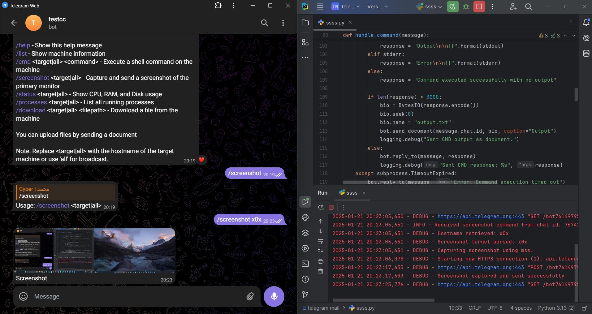

# Remote Access Tool (RAT) Using Telegram for Command and Control Server (C&C Server)

A lightweight and educational Remote Access Tool (RAT) leveraging Telegram as the Command and Control (C&C) server. This tool is designed **for educational purposes only** to demonstrate remote system monitoring and management using the Telegram Bot API.

---

## 🌟 Features

### 🖥️ System Information
Retrieve essential system details like hostname, operating system, and IP address.
- **Command:** `/list`

### ⚙️ Command Execution
Run shell commands on the target system remotely.
- **Command:** `/cmd <your_command>`

### 📊 System Monitoring
Monitor system resource usage, including CPU, RAM, and Disk.
- **Command:** `/status`

### 🔍 Process Management
Display a list of all running processes.
- **Command:** `/processes`

### 📂 File Management
- **Upload files** to the target system by sending them directly via Telegram.
- **Download specific files** from the target system.
  - **Command:** `/download <file_path>`

### 📸 Screen Capture
Capture and receive a screenshot of the target system's primary monitor.
- **Command:** `/screenshot`

---

## 🚀 Installation

1. Clone the repository:

    ```bash
    git clone https://github.com/your_username/Telegram-RAT.git
    cd Telegram-RAT
    ```

2. Configure the Telegram Bot API token in the script | API_TOKEN = 'YOUR_API_TOKEN_HERE' .

3. Run the script:

    ```bash
    python3 telegram_rat.py
    ```

---

## 📸 Screenshot



---
## ⚠️ Disclaimer

This tool is intended **strictly for educational purposes**. Unauthorized use on systems without explicit permission is illegal and unethical. Use responsibly and ensure compliance with local laws.
